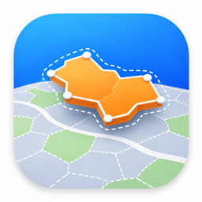
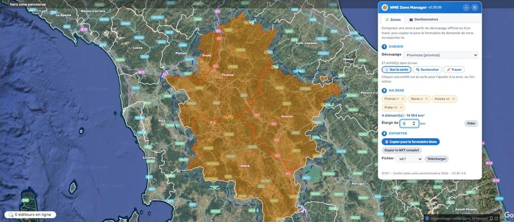
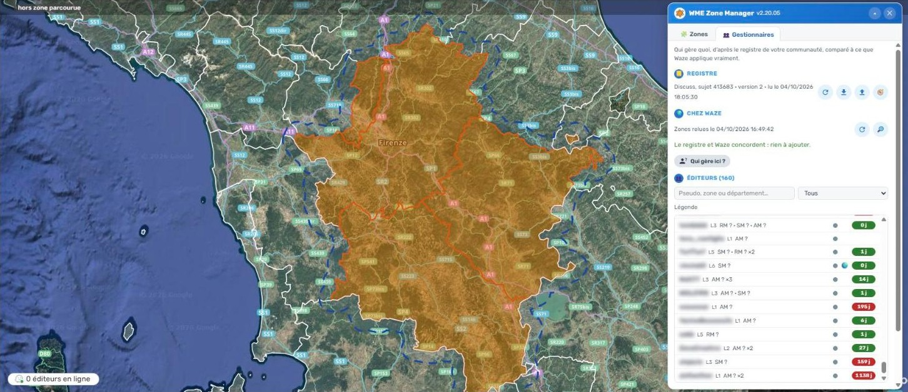
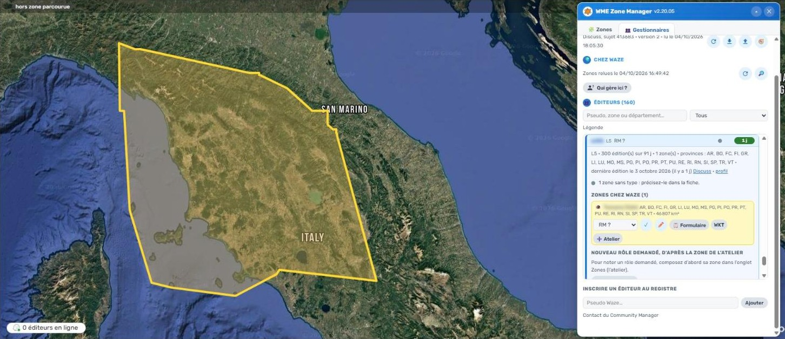
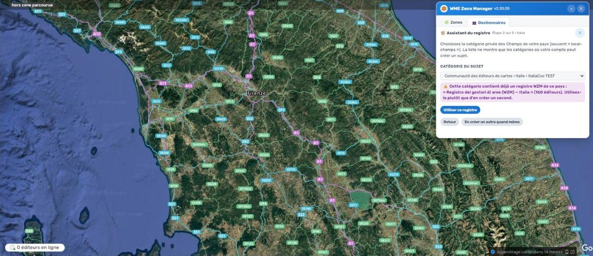

# WME Zone Manager

[English](#english) · [Français](#français)

## English

**WME Zone Manager (WZM)** is a Waze Map Editor script for country leaders. It does two things:

1. **Build an area from official boundaries** — municipalities, provinces, regions… shown on the WME map, click to combine them, widen by a few km, draw by hand, and copy the result **ready for the Waze area request form** (WKT that fits the form), or export it (GeoJSON, KML, Shapefile…).
2. **Know who manages what** — a shared **registry of area managers** for your country: every editor with managed areas, their areas and their type (AM, SM, RM, CM, Temporary), compared with what Waze actually applies (areas, level, last edit, absences), with requests and removals decided among Champs.

**Reserved to L6, Local Champs, Global Champs, Country Coordinators and Staff.** Other accounts only see a short refusal message.

## Countries with official boundaries

| Country | Levels | Source (licence) |
|---|---|---|
| France (incl. overseas) | regions, departments, arrondissements, EPCI, municipalities, Paris/Lyon/Marseille districts | IGN Admin Express (Licence Ouverte 2.0) |
| Italy | regions, provinces, metropolitan cities, municipalities | ISTAT 2026 (CC BY 4.0) |
| Spain | autonomous communities, provinces, municipalities | IGN España (CC BY 4.0) |
| Portugal (incl. Azores, Madeira) | districts and islands, municipalities, parishes | DGT CAOP 2025 |
| Belgium | regions, provinces, arrondissements, municipalities | SPF Finances (CC BY 4.0) |
| Luxembourg | cantons, municipalities | ACT (CC0) |
| Germany | states, districts, municipalities | BKG VG250 (dl-de/by-2-0) |
| Austria | states, districts, municipalities | Statistik Austria (CC BY 4.0) |
| Netherlands | provinces, municipalities | CBS / PDOK (CC BY 4.0) |
| Switzerland and Liechtenstein | cantons, districts, municipalities | swisstopo (OGD) |
| Ireland | counties, electoral divisions | Tailte Éireann (CC BY 4.0) |
| United Kingdom | nations, regions, counties and unitary authorities, districts, wards | ONS (OGL v3) |
| Czechia | regions, districts, municipalities | ČÚZK RÚIAN (CC BY 4.0) |
| Bulgaria | provinces, municipalities, land areas (EKATTE), city districts — Cyrillic and Latin names | AGKK INSPIRE (no conditions apply) |
| Cyprus | districts, municipalities and communities, quarters (pre-2024 units) | DLS INSPIRE (no conditions apply) |
| Latvia | municipalities and state cities, parishes and towns (ATVK) — built in | VZD INSPIRE 2024 (CC0) |
| Lithuania | counties, municipalities, elderships — built in | Registrų centras (CC BY 4.0) |
| Norway | counties (fylker), municipalities (kommuner) — built in, exact outline from the API on export | Kartverket (CC BY 4.0) |
| Sweden | counties (län, built in), municipalities (kommuner) | Lantmäteriet via a public Esri Sverige layer (CC0) |
| Poland | voivodeships, counties (powiaty), municipalities (gminy), TERYT codes | GUGiK PRG via a public Esri Polska layer (free by law) |
| Denmark | regions, municipalities (kommuner) | Klimadatastyrelsen DAGI via a public Geoinfo layer (free data) |
| Greece | regions (periferies), regional units (built in), municipalities, municipal units, communities; search in Greek or Latin script | YPEN (CC BY 4.0) |
| Hungary | counties (vármegyék), districts (járások), settlements (települések) | Lechner Tudásközpont, INSPIRE (no conditions on access and use) |
| Malta | districts, local councils (built in) | Planning Authority, INSPIRE (CC BY 4.0) |
| Israel | districts (built in), sub-districts (nafot), local authorities; search in Hebrew or English | Israel Planning Administration (CC BY) |
| Japan | prefectures (built in), municipalities; names in Japanese | MLIT N03 via a public Esri Japan layer (CC BY 4.0) |
| Ukraine | oblasts, raions, hromadas (built in); Ukrainian and Latin names | OCHA/HDX COD-AB, Kartographia (CC BY-IGO) |
| Türkiye | provinces (il), districts (ilçe) — built in | OCHA/HDX COD-AB, HGM (CC BY-IGO) |
| Malaysia | states (negeri), districts (daerah) — built in | DOSM, official data-open repository (CC BY 4.0) |
| Viet Nam | the 34 provinces of 2025 (built in) | OCHA/HDX COD-AB, GSO (CC BY-IGO) |
| Philippines | regions, provinces, cities and municipalities — built in, 2018 boundaries | OCHA/HDX COD-AB, NAMRIA and PSA (CC BY-IGO) |
| North Macedonia | statistical regions, municipalities (built in); Macedonian and English names | OCHA/HDX COD-AB (CC BY-IGO) |
| Albania | counties (qarqe), municipalities (bashki), administrative units — built in | OCHA/HDX COD-AB 2019 (CC BY-IGO) |
| Moldova | raions and municipalities (built in) | OCHA/HDX COD-AB (CC BY-IGO) |
| Indonesia | provinces, regencies and cities — built in, 2020 edition | OCHA/HDX COD-AB (CC BY-IGO) |
| Thailand | provinces (changwat), districts (amphoe) — built in; Thai and Latin names | OCHA/HDX COD-AB, Royal Thai Survey Department (CC BY-IGO) |
| Australia | states and territories, local government areas (LGA), suburbs and localities | ABS ASGS Edition 3 (CC BY 4.0) |
| New Zealand | regions, territorial authorities, wards | Stats NZ (CC BY 4.0) |
| Brazil | states (UF), municipalities (municípios) — built in, exact outline from IBGE on export | IBGE (public data, Law 12.527/2011) |
| Mexico | states (entidades), municipalities — built in, exact outline from INEGI on export | INEGI (free use terms) |
| Chile | regions, provinces (built in), communes (comunas) | INE Chile (CC BY-SA 4.0) |
| Colombia | departments (built in), municipalities | DANE MGN 2024 via UPRA (CC BY 4.0) |
| Argentina | provinces (built in), departments (partidos), municipalities | IGN Argentina (free use, source credited) |
| Uruguay | departments (built in), municipalities (municipios) | IDE Uruguay (Open Data Licence) |
| Puerto Rico | municipios, barrios | U.S. Census Bureau, TIGERweb (public domain) |
| Paraguay | departments, districts — built in | OCHA/HDX COD-AB, INE (CC BY-IGO) |
| Bolivia | departments, provinces, municipalities — built in | OCHA/HDX COD-AB, MDRyT (CC BY-IGO) |
| Venezuela | states, municipalities, parishes (parroquias) — built in | OCHA/HDX COD-AB, INE (CC BY-IGO) |
| Panama | provinces, districts, corregimientos — built in | OCHA/HDX COD-AB (CC BY-IGO) |
| Guatemala | departments, municipalities — built in | OCHA/HDX COD-AB (CC BY-IGO) |
| Peru | regions, provinces, districts — built in | OCHA/HDX COD-AB (CC BY-IGO) |
| Slovakia | regions, districts, municipalities | ÚGKK ZBGIS (CC BY 4.0) |
| Slovenia | statistical regions, municipalities, settlements | GURS (CC BY 4.0) |
| Romania | counties, municipalities (UAT) | ANCPI (CC BY 4.0) |
| Finland | regions, municipalities | Statistics Finland (CC BY 4.0) |
| Estonia | counties, municipalities, settlements | Maa- ja Ruumiamet (open licence) |
| Iceland | districts, municipalities | IS 50V (CC BY 4.0) |
| United States | states, counties, cities (incorporated places) | U.S. Census Bureau, TIGERweb (public domain) |
| Canada | provinces and territories, census divisions, municipalities (census subdivisions) | Statistics Canada (Open Government Licence – Canada) |
| Nigeria | states, local government areas (LGA) | GRID3 Nigeria (CC BY 4.0) |
| Rwanda | provinces, districts, sectors | NISR Rwanda (public access, no constraints) |
| Africa (52 other countries, incl. Western Sahara as a separate unit) | regions or provinces, districts or departments | FAO GAUL 2024/2025 (CC BY 4.0) |
| Mauritius (incl. Rodrigues) | districts, villages and towns | official data, built into the script |

That is **115 countries**. The managers registry, the survey of managed areas and the area tools also work in **any other country**; only the official boundaries are missing there. WZM recognises the country under the centre of the map, even zoomed out.

## The area workshop

- Pick a level, click entities on the map to add or remove them, search by name or code (INSEE, postcode, ISTAT…).
- **Widen by N km**, **draw by hand**, merge everything into one area.
- **Copy for the Waze form**: the WKT is simplified until it fits the form, small islands kept.
- Export: WKT, GeoJSON, KML, Shapefile.
- **Local data**: boundaries are kept in your browser; whole packages can be downloaded once (e.g. a Spanish province) so the map no longer waits for the network.

## The managers registry

- Lives in the **first post (a wiki) of a Discuss topic in your country's PRIVATE Champs category**. WZM refuses to read or write a registry anywhere else, so it never ends up public.
- **First use: an assistant** creates the topic for you (category chosen in a list, title and welcome text suggested), **surveys the whole country at Waze** (every managed area, square by square), and fills the registry. Each area gets a **suggested type** from what it really covers (CM, RM, SM, AM, Temporary), which a Champ validates.
- Then, for each editor: areas at Waze, departments/provinces covered, level, edits over 91 days, last edit, areas abroad 🌍, gaps between the registry and Waze, statuses (in force, requested, to remove, removed), "Who manages here?" on the map, and a ready-made removal email.
- Other Champs only paste the topic link in WZM's Scripts tab. Discuss decides who can read and write; WZM never overwrites someone else's work (version check on save).
- "Survey at Waze" 🔎 compares the registry with Waze later: editors missing from the registry, editors with no area left.
- **CM on a whole country** 🌐: a CM right requested by choosing a country (not a polygon) creates no area at Waze and is invisible to everyone but its holder. Note it by hand in the editor’s card: it is tied to the country outline, found by “Who manages here?”.
- **Community titles**: on top of its type (AM, SM, RM, CM…), every area and every role can carry the titles **LC, GC, CC, CPC, Booster**, combined (“CM + LC + CPC”). They show as badges next to the username and can filter the list.
- **Permissions by level**: each editor's card lists the 32 features Waze unlocks by level (cameras, lanes, junction boxes, closures, new cities…), with the level required in the registry's country and whether the editor has it. The thresholds are read live from WME, for any country; they depend on the level only.
- **Wide view** ⤢: the editor list on the left, the card on the right; the editor header stays pinned, sections fold.

## Good to know

- WZM **never edits the map**. It reads Waze, the official boundary services above, and Discuss.
- Starts at every zoom level. 8 languages: English, French, German, Spanish, Italian, Portuguese (Brazil and Portugal), Hebrew.
- If the map moves to another country while a registry is shown, WZM asks before switching.
- Issues and source: see this repository.

## Screenshots

| | |
|---|---|
|  |  |
| *Area workshop: four provinces combined, widened by 5 km, ready for the Waze form* | *Managers registry, compared with what Waze applies (usernames blurred)* |
|  |  |
| *Editor card: areas at Waze, provinces covered, suggested type* | *Set-up assistant: it finds the registry already in the category* |

## Install

1. Install [Tampermonkey](https://www.tampermonkey.net/) (Chrome, Edge, Firefox). In Chrome, allow user scripts: Extensions › Tampermonkey › Details › *Allow user scripts*.
2. Click **[Install WME Zone Manager](https://raw.githubusercontent.com/DrSlump34/WME-Zone-Manager/main/WME-Zone-Manager.user.js)** and confirm in Tampermonkey.
3. Reload WME: an orange button appears in the column of map buttons on the right.

Do not copy and paste the file into Tampermonkey: it is large and the paste can be cut, which leaves a script that does not start.

## Data and licences

The official boundaries come from the services listed above, under their own licences (attribution shown in the script). Spain's provinces and the world borders (Natural Earth, public domain) are served from the `donnees/` folder of this repository as `@resource` files, pinned by commit and sha256.

Script: MIT licence.

---

## Français

**WME Zone Manager (WZM)** est un script pour le Waze Map Editor, destiné aux responsables d’un pays. Il fait deux choses :

1. **Composer une zone à partir du découpage officiel** — communes, départements, provinces, régions… affichés sur la carte de WME ; on clique pour les réunir, on élargit de quelques km, on trace à la main, et on copie le résultat **prêt pour le formulaire de demande de zone de Waze** (un WKT qui tient dans le formulaire), ou on l’exporte (GeoJSON, KML, Shapefile…).
2. **Savoir qui gère quoi** — un **registre des gestionnaires de zones** partagé pour votre pays : chaque éditeur qui gère des zones, ses zones et leur type (AM, SM, RM, CM, Temporaire), comparés à ce que Waze applique vraiment (zones, niveau, dernière édition, absences), avec les demandes et les retraits décidés entre Champs.

**Réservé aux L6, Local Champs, Global Champs, Country Coordinators et Staff.** Les autres comptes ne voient qu’un court message de refus.

## Pays dotés du découpage officiel

| Pays | Niveaux | Source (licence) |
|---|---|---|
| France (outre-mer compris) | régions, départements, arrondissements, EPCI, communes, arrondissements de Paris, Lyon et Marseille | IGN Admin Express (Licence Ouverte 2.0) |
| Italie | régions, provinces, villes métropolitaines, communes | ISTAT 2026 (CC BY 4.0) |
| Espagne | communautés autonomes, provinces, communes | IGN España (CC BY 4.0) |
| Portugal (Açores et Madère compris) | districts et îles, communes, paroisses | DGT CAOP 2025 |
| Belgique | régions, provinces, arrondissements, communes | SPF Finances (CC BY 4.0) |
| Luxembourg | cantons, communes | ACT (CC0) |
| Allemagne | Länder, arrondissements, communes | BKG VG250 (dl-de/by-2-0) |
| Autriche | Länder, districts, communes | Statistik Austria (CC BY 4.0) |
| Pays-Bas | provinces, communes | CBS / PDOK (CC BY 4.0) |
| Suisse et Liechtenstein | cantons, districts, communes | swisstopo (OGD) |
| Irlande | comtés, divisions électorales | Tailte Éireann (CC BY 4.0) |
| Royaume-Uni | nations, régions, comtés et autorités unitaires, districts, wards | ONS (OGL v3) |
| Tchéquie | régions, districts, communes | ČÚZK RÚIAN (CC BY 4.0) |
| Bulgarie | régions, communes, finages (EKATTE), arrondissements urbains — noms cyrilliques et latins | AGKK INSPIRE (sans condition) |
| Chypre | districts, communes et communautés, quartiers (unités d’avant 2024) | DLS INSPIRE (sans condition) |
| Lettonie | municipalités et villes d’État, paroisses et villes (ATVK) — intégrés | VZD INSPIRE 2024 (CC0) |
| Lituanie | comtés, municipalités, seniūnijos — intégrés | Registrų centras (CC BY 4.0) |
| Norvège | comtés (fylker), communes (kommuner) — intégrés, contour exact demandé à l’API pour l’export | Kartverket (CC BY 4.0) |
| Suède | comtés (län, intégrés), communes (kommuner) | Lantmäteriet via une couche publique d’Esri Sverige (CC0) |
| Pologne | voïvodies, districts (powiaty), communes (gminy), codes TERYT | GUGiK PRG via une couche publique d’Esri Polska (libre par la loi) |
| Danemark | régions, communes (kommuner) | Klimadatastyrelsen DAGI via une couche publique de Geoinfo (données libres) |
| Grèce | régions (periféries), unités régionales (intégrées), dèmes, unités municipales, communautés ; recherche en grec ou en latin | ΥΠΕΝ (CC BY 4.0) |
| Hongrie | comitats (vármegyék), districts (járások), communes (települések) | Lechner Tudásközpont, INSPIRE (accès et usage libres) |
| Malte | districts, conseils locaux (intégrés) | Planning Authority, INSPIRE (CC BY 4.0) |
| Israël | districts (intégrés), sous-districts (nafot), autorités locales ; recherche en hébreu ou en anglais | Administration de la planification (CC BY) |
| Japon | préfectures (intégrées), municipalités ; noms en japonais | MLIT 国土数値情報 N03 via une couche publique d’Esri Japan (CC BY 4.0) |
| Ukraine | oblasts, raïons, hromadas (intégrés) ; noms ukrainiens et latins | OCHA/HDX COD-AB, Kartographia (CC BY-IGO) |
| Turquie | provinces (il), districts (ilçe) — intégrés | OCHA/HDX COD-AB, HGM (CC BY-IGO) |
| Malaisie | États (negeri), districts (daerah) — intégrés | DOSM, dépôt officiel data-open (CC BY 4.0) |
| Viêt Nam | les 34 provinces de 2025 (intégrées) | OCHA/HDX COD-AB, GSO (CC BY-IGO) |
| Philippines | régions, provinces, villes et municipalités — intégrées, limites de 2018 | OCHA/HDX COD-AB, NAMRIA et PSA (CC BY-IGO) |
| Macédoine du Nord | régions statistiques, municipalités (intégrées) ; noms macédoniens et anglais | OCHA/HDX COD-AB (CC BY-IGO) |
| Albanie | préfectures (qarqe), communes (bashki), unités administratives — intégrées | OCHA/HDX COD-AB 2019 (CC BY-IGO) |
| Moldavie | raions et municipalités (intégrés) | OCHA/HDX COD-AB (CC BY-IGO) |
| Indonésie | provinces, kabupaten et kota — intégrés, millésime 2020 | OCHA/HDX COD-AB (CC BY-IGO) |
| Thaïlande | provinces (changwat), districts (amphoe) — intégrés ; noms thaïs et latins | OCHA/HDX COD-AB, Royal Thai Survey Department (CC BY-IGO) |
| Australie | états et territoires, collectivités locales (LGA), localités | ABS ASGS Edition 3 (CC BY 4.0) |
| Nouvelle-Zélande | régions, autorités territoriales, circonscriptions (wards) | Stats NZ (CC BY 4.0) |
| Brésil | États (UF), communes (municípios) — intégrés, contour exact demandé à l’IBGE pour l’export | IBGE (données publiques, loi 12.527/2011) |
| Mexique | États (entidades), communes — intégrés, contour exact demandé à l’INEGI pour l’export | INEGI (libre usage) |
| Chili | régions, provinces (intégrées), communes (comunas) | INE Chile (CC BY-SA 4.0) |
| Colombie | départements (intégrés), communes (municipios) | DANE MGN 2024 via l’UPRA (CC BY 4.0) |
| Argentine | provinces (intégrées), départements (partidos), communes (municipios) | IGN Argentine (usage libre, source citée) |
| Uruguay | départements (intégrés), communes (municipios) | IDE Uruguay (Licence de données ouvertes) |
| Porto Rico | municipios, barrios | U.S. Census Bureau, TIGERweb (domaine public) |
| Paraguay | départements, districts — intégrés | OCHA/HDX COD-AB, INE (CC BY-IGO) |
| Bolivie | départements, provinces, communes (municipios) — intégrés | OCHA/HDX COD-AB, MDRyT (CC BY-IGO) |
| Venezuela | États, communes (municipios), paroisses (parroquias) — intégrés | OCHA/HDX COD-AB, INE (CC BY-IGO) |
| Panama | provinces, districts, corregimientos — intégrés | OCHA/HDX COD-AB (CC BY-IGO) |
| Guatemala | départements, communes (municipios) — intégrés | OCHA/HDX COD-AB (CC BY-IGO) |
| Pérou | régions, provinces, districts — intégrés | OCHA/HDX COD-AB (CC BY-IGO) |
| Slovaquie | régions, districts, communes | ÚGKK ZBGIS (CC BY 4.0) |
| Slovénie | régions statistiques, communes, localités | GURS (CC BY 4.0) |
| Roumanie | départements (județe), communes (UAT) | ANCPI (CC BY 4.0) |
| Finlande | régions, communes | Statistics Finland (CC BY 4.0) |
| Estonie | comtés, communes, localités | Maa- ja Ruumiamet (licence ouverte) |
| Islande | circonscriptions, communes | IS 50V (CC BY 4.0) |
| États-Unis | États, comtés, villes (incorporated places) | U.S. Census Bureau, TIGERweb (domaine public) |
| Canada | provinces et territoires, divisions de recensement, municipalités (subdivisions de recensement) | Statistique Canada (Licence du gouvernement ouvert – Canada) |
| Nigeria | États, collectivités locales (LGA) | GRID3 Nigeria (CC BY 4.0) |
| Rwanda | provinces, districts, secteurs | NISR Rwanda (accès public, sans restriction) |
| Afrique (52 autres pays, Sahara occidental comme entité à part) | régions ou provinces, districts ou départements | FAO GAUL 2024/2025 (CC BY 4.0) |
| Maurice (Rodrigues comprise) | districts, villages et villes | données officielles, intégrées au script |

Soit **115 pays**. Le registre des gestionnaires, le recensement des zones gérées et les outils de zone fonctionnent aussi dans **tout autre pays** : seul le découpage officiel y manque. WZM reconnaît le pays sous le centre de la carte, même dézoomé.

## L’atelier de zones

- Choisir un niveau, cliquer les entités sur la carte pour les ajouter ou les retirer, chercher par nom ou par code (INSEE, code postal, ISTAT…).
- **Élargir de N km**, **tracer à la main**, tout réunir en une zone.
- **Copier pour le formulaire Waze** : le WKT est simplifié jusqu’à tenir dans le formulaire, petites îles gardées.
- Export : WKT, GeoJSON, KML, Shapefile.
- **Données locales** : les contours sont gardés dans le navigateur ; des paquets entiers se téléchargent une fois (une province espagnole, par exemple), et la carte n’attend plus le réseau.

## Le registre des gestionnaires

- Il vit dans le **premier message (un wiki) d’un sujet Discuss, dans la catégorie PRIVÉE des Champs de votre pays**. WZM refuse de lire ou d’écrire un registre ailleurs : il ne finit jamais en public.
- **Première utilisation : un assistant** crée le sujet pour vous (catégorie choisie dans une liste, titre et texte d’accueil proposés), **recense tout le pays chez Waze** (chaque zone gérée, carré par carré) et remplit le registre. Chaque zone reçoit un **type proposé** d’après ce qu’elle couvre vraiment (CM, RM, SM, AM, Temporaire), qu’un Champ valide.
- Ensuite, pour chaque éditeur : ses zones chez Waze, les départements ou provinces couverts, son niveau, ses éditions sur 91 jours, sa dernière édition, ses zones à l’étranger 🌍, les écarts entre le registre et Waze, les statuts (en vigueur, demandé, à retirer, retiré), « Qui gère ici ? » sur la carte, et un courriel de retrait tout prêt.
- Les autres Champs n’ont qu’à coller le lien du sujet dans l’onglet Scripts de WZM. C’est Discuss qui décide qui peut lire et écrire ; WZM n’écrase jamais le travail d’un autre (contrôle de version à l’enregistrement).
- « Recenser chez Waze » 🔎 compare plus tard le registre à Waze : éditeurs absents du registre, éditeurs qui n’ont plus aucune zone.
- **CM sur tout un pays** 🌐 : un droit de CM demandé en choisissant un pays (et non avec un polygone) ne crée aucune zone chez Waze et n’est visible que de son titulaire. Il se note à la main dans la fiche de l’éditeur : rattaché au contour du pays, il est retrouvé par « Qui gère ici ? ».
- **Titres communautaires** : en plus de son type (AM, SM, RM, CM…), chaque zone et chaque rôle peut porter les titres **LC, GC, CC, CPC, Booster**, cumulables (« CM + LC + CPC »). Ils s’affichent en badges à côté du pseudo et servent de filtre dans la liste.
- **Droits par niveau** : la fiche de chaque éditeur liste les 32 fonctions que Waze débloque selon le niveau (radars, voies, carrefours complexes, fermetures, nouvelles villes…), avec le niveau requis dans le pays du registre et si l’éditeur l’a. Les seuils sont lus en direct dans WME, pour n’importe quel pays ; ils ne dépendent que du niveau.
- **Version large** ⤢ : la liste des éditeurs à gauche, la fiche à droite ; en-tête de l’éditeur figé, sections repliables.

## Bon à savoir

- WZM **ne modifie jamais la carte**. Il lit Waze, les services officiels de découpage ci-dessus et Discuss.
- Démarre à tous les niveaux de zoom. 8 langues : anglais, français, allemand, espagnol, italien, portugais (Brésil et Portugal), hébreu.
- Si la carte passe dans un autre pays alors qu’un registre est affiché, WZM demande avant de basculer.
- Anomalies et code source : voir ce dépôt.

## Captures

| | |
|---|---|
|  |  |
| *Atelier : quatre provinces réunies, élargies de 5 km, prêtes pour le formulaire Waze* | *Registre des gestionnaires, comparé à ce que Waze applique (pseudos floutés)* |
|  |  |
| *Fiche d’un éditeur : zones chez Waze, provinces couvertes, type proposé* | *Assistant de mise en place : il trouve le registre déjà présent dans la catégorie* |

## Installation

1. Installer [Tampermonkey](https://www.tampermonkey.net/) (Chrome, Edge, Firefox). Dans Chrome, autoriser les scripts utilisateur : Extensions › Tampermonkey › Détails › *Autoriser les scripts utilisateur*.
2. Cliquer **[Installer WME Zone Manager](https://raw.githubusercontent.com/DrSlump34/WME-Zone-Manager/main/WME-Zone-Manager.user.js)** et confirmer dans Tampermonkey.
3. Recharger WME : un bouton orange apparaît dans la colonne des boutons de carte, à droite.

Ne pas copier-coller le fichier dans Tampermonkey : il est gros, le collage peut être coupé, et le script ne démarre plus.

## Données et licences

Les découpages officiels viennent des services cités plus haut, sous leurs propres licences (attribution affichée dans le script). Les provinces espagnoles et les frontières du monde (Natural Earth, domaine public) sont servies depuis le dossier `donnees/` de ce dépôt, en fichiers `@resource` figés par commit et empreinte sha256.

Script : licence MIT.
